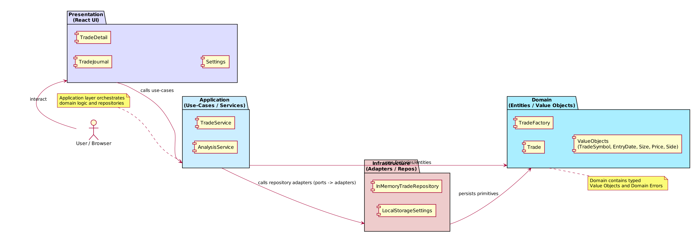
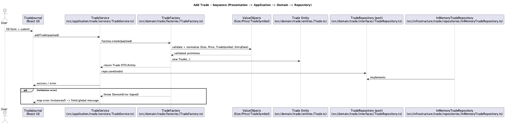

= ARCHITECTURE: Monkey-Trader — Onion / DDD Übersicht
:toc:
:toclevels: 2
:icons: font
:experimental: true
:plantuml:

== Ziel
Dieses Dokument beschreibt die angewandte Onion-Architektur und Domain-Driven-Design (DDD)-Konventionen im Projekt "traders-mirror". Es zeigt die wichtigsten Module, Pfade und Konventionen sowie Hinweise zum lokalen Erzeugen der Dokumentation.

== Übersicht
Das Projekt folgt der Onion-Architektur mit klar getrennten Schichten:
- Domain (Kern): Geschäftskonzepte, Entities, Value Objects, Domain-Errors, Factories.
- Application: Use-Cases / Services, orchestriert Domain-Operationen.
- Infrastructure: Adapters / Repositories, Implementierungen externer Abhängigkeiten.
- Presentation: React-Komponenten, UI, Tests.

Quellen (Beispiele im Repository):
- Domain:
  - `src/domain/trade/entities/Trade.ts`
  - `src/domain/trade/value-objects/Size.ts`
  - `src/domain/trade/value-objects/Price.ts`
  - `src/domain/trade/value-objects/TradeSymbol.ts`
  - `src/domain/trade/factories/TradeFactory.ts`
  - `src/domain/trade/errors/DomainErrors.ts`
- Application:
  - `src/application/trade/services/TradeService.ts`
- Infrastructure (Adapter):
  - `src/infrastructure/trade/repositories/InMemoryTradeRepository.ts`
- Presentation:
  - `src/presentation/trade/TradeJournal.tsx`
  - `src/presentation/trade/TradeJournal.module.css`

== Schichten im Detail

=== Domain (Kern)
- Enthält Entities, Value Objects (VOs), Domain-spezifische Fehler und Factories.
- VOs kapseln Validierung und Normalisierung (z. B. `TradeSymbol` trim/uppercase, `EntryDate` -> ISO).
- Domain-Fehler sind typisierte Klassen (z. B. `SizeMustBePositiveError`) und werden mit `instanceof` behandelt.
- Factory-Pattern: `TradeFactory.create(input)` akzeptiert primitive DTOs oder VOs, validiert und liefert stabile, primitive DTO/Entity-Objekte für die Außenwelt.

Beispiel-Pfade:
- `src/domain/trade/entities/Trade.ts`
- `src/domain/trade/factories/TradeFactory.ts`
- `src/domain/trade/value-objects/`

=== Application
- Use-Cases / Services orchestrieren Domain-Operationen und benutzen `import type` für Repository-Interfaces.
- Keine Business-Logik in Presentation.
- Beispiel: `src/application/trade/services/TradeService.ts`

=== Infrastructure (Ports & Adapters)
- Implementiert Interfaces aus Domain/Application.
- Adapter halten keine Business-Logik, nur Persistenz oder externe Integration.
- Beispiel: `src/infrastructure/trade/repositories/InMemoryTradeRepository.ts`

=== Presentation
- React funktionale Komponenten (Hooks), CSS-Module für Styling.
- Beispiel: `src/presentation/trade/TradeJournal.tsx` + `TradeJournal.module.css`.
- Fehlerübersetzung: Presentation führt `instanceof`-Checks der Domain-Errors durch und mappt sie auf Nutzerfeeback.

== Konventionen & Regeln
- Import-Alias: Verwende `@` für `src/` (Vite-Config).
  - Beispiel: `import { Trade } from '@/domain/trade/entities/Trade'`
- TypeScript: Strikte Typisierung, kein `any`. Verwende `unknown` + Narrowing oder konkrete Schnittstellen.
- Interfaces immer als Typ exportieren:
  - `export type TradeRepository = { save(trade: Trade): Promise<void>; getAll(): Promise<Trade[]> }`
  - In Adaptern/Services: `import type { TradeRepository } from '@/domain/trade/interfaces/TradeRepository'`
- Domain-Errors: Typisierte Fehlerklassen (keine generischen Error-Strings).
- Factories: Normalisieren Input-Formate, liefern primitive Entities/DTOs.
- Tests: TDD mit Vitest; Tests für Feature/VO/Factory/Service. Test-Pfade folgen Konventionen (siehe repo).

== How-to: Lokales Generieren der Dokumentation
(Anmerkung: es gibt mehrere Optionen, siehe unten für Tooling; Beispiele basieren auf empfohlenen npm-Scripts.)

1) Voraussetzungen (minimal):
- Node.js >= 16 (empfohlen)
- npm oder yarn
- Java 11+ (für PlantUML)
- optional: Graphviz (für einige Diagram-Typen)

2) Lokaler Build (Beispiel npm-Script):
- `npm ci`
- `npm run docs:build`  // erzeugt HTML in `docs/build/`

3) Output:
- HTML- und Diagram-Dateien landen in `docs/build/`
- Bei Bedarf: `docs/build/assets/diagrams/*.png` oder `*.svg` für PlantUML-Generierung

== CI / Integration
- In CI (GitHub Actions) setze Java und Node auf die benötigten Versionen, führe `npm ci` und `npm run docs:build` aus und lade `docs/build` als Artifact hoch (Beispiel-Snippet in `docs/README.adoc`).

== Weitere Hinweise
- Für reproduzierbare Builds empfiehlt sich ein Docker-Image mit Asciidoctor + asciidoctor-diagram (z. B. `asciidoctor/docker-asciidoctor`).
- Siehe `docs/diagrams/` für die PlantUML-Quellen der Architektur- und Sequenzdiagramme.

== Diagramme (Best Practice)
Die Diagramme werden als PlantUML-Quellen im Verzeichnis `docs/diagrams/` gehalten. Best Practice ist, die `.puml`-Quellen direkt in AsciiDoc einzubetten oder per plantuml-macro einzubinden, damit `asciidoctor-diagram` die Diagramme beim Rendern erzeugt.

Praktische Darstellung (PNG-Fallbacks, da die generierten PNGs in `docs/diagrams/` liegen):

image::diagrams/custom_components.png[alt="Custom Components Diagram",align="center"]

== Custom Components
Dieses Kapitel zeigt unsere maßgeschneiderten UI-/Präsentations-Komponenten und wie sie sich in die Onion-Schichten einfügen. Das Diagramm visualisiert die wichtigsten Komponenten und deren Beziehungen zu Application- und Infrastructure-Layern.

image::diagrams/custom_components.png[alt="Custom Components Diagram",align="center"]

== Ergänzende Architektur-Notizen

Diese Sektion fasst ergänzende Hinweise und eine Empfehlung zur Ordnerstruktur zusammen (Inhalt aus `ARCHITECTURE.md`, in AsciiDoc konvertiert).

=== Ziele
- Klare Trennung von Geschäftslogik (Domain) und UI (Presentation)
- Testbare Use-Cases (Application)
- Austauschbare Adapter (Infrastructure)
- Feature-orientierte Organisation

=== Schichten (von innen nach außen)
- Domain: Entities, Value Objects, Domain Errors, Interfaces (Ports)
- Application: Use-Cases / Services, DTOs, Validatoren
- Infrastructure: Adapter-Implementierungen (Repositories, HTTP-Clients, ORM-Mapping)
- Presentation: React-Komponenten, Pages, Hooks, CSS Modules

=== Empfohlene Ordnerstruktur (src/)
----
src/
- domain/
  - <feature>/
    - entities/
    - value-objects/
    - interfaces/    # `export type`-Interfaces (Ports)
    - errors/
- application/
  - <feature>/
    - services/      # Use-Cases
    - dtos/
    - validators/
- infrastructure/
  - <feature>/
    - repositories/  # Adapter-Implementierungen (InMemory, HTTP, DB)
    - api/
    - orm/
- presentation/
  - pages/
  - components/
  - hooks/
  - styles/
- shared/
  - di/              # composition root / dependency wiring
  - config/
  - utils/
  - types/
----

Tests: bevorzugt TDD — Domain & Application zuerst. Tests colocated oder unter `src/**/*.test.ts`.

=== Konventionen
- TypeScript strikt: kein `any`; Interfaces als `export type`.
- Typ-Imports: `import type { ... }` wo möglich.
- React: Funktionale Komponenten + Hooks; Styles per CSS Modules (keine Inline-Styles).
- Commit-Nachrichten nach SemVer-Präfixen: `feat:`, `fix:`, `chore:`.
- Test-Framework: `vitest`; UI-Testing: `@testing-library/react`.

=== Beispiel: Trade-Feature (Mapping)
- `src/domain/trade/entities/Trade.ts` — validierendes Entity
- `src/domain/trade/interfaces/TradeRepository.ts` — `export type TradeRepository = { save(trade: Trade): Promise<void>; getAll(): Promise<Trade[]> }`
- `src/application/trade/services/TradeService.ts` — Use-Case/Orchestrierung, erhält `TradeRepository` im Konstruktor
- `src/infrastructure/trade/repositories/InMemoryTradeRepository.ts` — einfache Adapter-Implementierung
- `src/presentation/trade/TradeJournal.tsx` — Komponente (Form + Liste) nutzt `TradeService` aus `shared/di`

=== Tooling & Scripts (empfohlen)
- `dev`, `build`, `start`, `test`, `lint`, `format` in `package.json`
- `eslint` + `prettier`, `husky` + `lint-staged` optional
- CI: build + test + lint bei PRs

=== Composition Root
`src/shared/di/index.ts` (oder `composition.ts`) erstellt Instanzen (Repositories, Services) und injiziert sie in die Presentation.

=== Nächste Schritte (konkret)
. Decide welches Feature zuerst (z. B. `trade`).
. Scaffold: Leere Ordner + Platzhalter-Dateien gemäß Struktur.
. TDD: Domain-Tests für `Trade` schreiben.
. Implement: InMemory Adapter, `TradeService`, UI-Komponente.
. CI + Linting einrichten.
