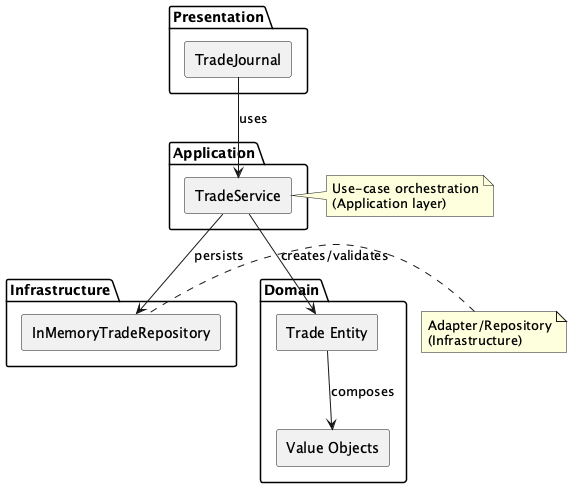

= COMPONENTS: Presentation Shared Components
:toc:
:toclevels: 2
:icons: font
:plantuml:

Dieser Abschnitt dokumentiert die wiederverwendbaren Presentation-Komponenten, die unter `src/presentation/shared/components` liegen. Ziel ist eine kompakte API-Referenz (Props), Hinweise zur Implementation und zum Testen sowie ein visuelles Diagramm, das ihre Rolle im System zeigt.

== Übersicht
Die folgenden Komponenten werden derzeit als "Shared Components" verwendet:
- Button (`src/presentation/shared/components/Button.tsx`)
- Icon (`src/presentation/shared/components/Icon.tsx`)

== Diagramm
Das PlantUML-Diagramm visualisiert die Beziehung der Shared Components zur Presentation- und Application-Schicht.

ifdef::plantuml[]
plantuml::diagrams/custom_components.puml[format="png", alt="Custom Components Diagram"]
endif::plantuml[]

ifndef::plantuml[]

endif::plantuml[]

== Button
Pfad: `src/presentation/shared/components/Button.tsx`

Beschreibung::
- Wiederverwendbare Schaltfläche für das UI.
- Unterstützt verschiedene Varianten (z. B. primary/secondary), Größen und deaktivierten Zustand.
- Styling über CSS-Module: `src/presentation/shared/components/Button.module.css`.

=== API (Props)
[cols="1,1,1"]
|===
| Name | Typ | Beschreibung
| onClick | `(e: React.MouseEvent<HTMLButtonElement>) => void` | Click-Handler
| variant | `"primary" | "secondary"` | opt. Variante für Styling
| size | `"sm" | "md" | "lg"` | opt. Größe
| disabled | `boolean` | opt. deaktiviert
| className | `string` | opt. zusätzliche CSS-Klassen
|===

=== Accessibility
- Nutze `aria-disabled` wenn `disabled` gesetzt ist.
- Button sollte bei Bedarf `aria-label` erhalten (z. B. bei Icon-only Buttons).

=== Tests
- Unit: Prüfe Rendering aller Varianten, click-Handler und disabled state (Vitest + Testing Library).
- Accessibility: Sicherstellen, dass Button fokussierbar/operierbar ist (a11y-Lint / axe-core Tests).

== Icon
Pfad: `src/presentation/shared/components/Icon.tsx`

Beschreibung::
- SVG-basierte Icons, zentralisiert, klein und performant.
- Props steuern Name, Größe und ARIA-Attribute.
- Styling über CSS-Module: `src/presentation/shared/components/Icon.module.css`.

=== API (Props)
[cols="1,1,1"]
|===
| Name | Typ | Beschreibung
| name | `string` | required — Icon-Id / Filename
| size | `number` | opt. Pixelgröße (z. B. 16, 24)
| ariaLabel | `string` | opt. für Screenreader
| className | `string` | opt. zusätzliche CSS-Klassen
|===

=== Accessibility
- Wenn das Icon dekorativ ist, setze `aria-hidden="true"`.
- Wenn das Icon semantisch ist, gebe `aria-label` oder eine sichtbare Beschriftung an.

=== Tests
- Snapshot/Render-Tests für verschiedene Icon-Namen und Größen.
- Accessibility: `aria-hidden` vs `aria-label` Verhalten prüfen.

== Implementierungs-Hinweise
- Komponenten sollen rein Präsentationslogik enthalten — keine Business-Logik.
- Verwende TypeScript-Typen strikt (kein `any`).
- Exportiere Component-Prop-Typen als `export type` wenn sie von anderen Modulen konsumiert werden.

== Wie man lokal aktualisiert
- Diagramme (PlantUML) mit:

[source,bash]
----
node ./scripts/plantuml-build.mjs
----

- Docs (AsciiDoc) bauen: (Beispiel-Workflow)

[source,bash]
----
npm ci
npm run docs:build
----

Die CI-Action `.github/workflows/render-puml.yml` sorgt dafür, dass beim Ändern von `.puml`-Dateien PNGs erzeugt werden und (optional) ein PR mit den generierten Bildern geöffnet wird.

== Weiteres
Wenn du möchtest, erweitere ich diese Datei um weitere Shared Components (z. B. Input, Modal) und generiere eine kleine Referenz-Tabelle automatisch aus den Prop-Typen (kann ich per statischem TypeScript-Parser/AST extrahieren, wenn du das willst).
