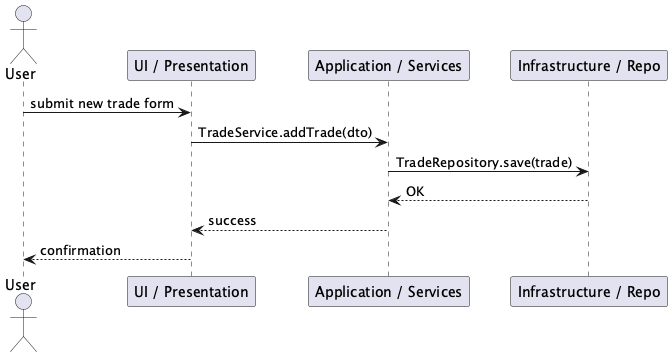

# Architecture Overview

This page collects the project's architecture diagrams in PNG format so they render on GitHub and other markdown viewers.

Diagrams are expected to be present in `docs/diagrams/` so they can be displayed directly in this markdown.

---

## Diagrams

### System Architecture


### Components


### Sequence



### Use Cases


---

## Regenerating diagrams

Diagrams are authored as `.puml` files inside `docs/diagrams`.
Use the included Node script to render them to PNGs (requires the `plantuml` binary + graphviz + Java):

```bash
# from repository root
node --experimental-specifier-resolution=node ./scripts/plantuml-build.mjs
```

On Ubuntu you can install dependencies with:

```bash
sudo apt-get update && sudo apt-get install -y plantuml graphviz default-jre
```

The script writes generated images to `docs/build/assets/diagrams`, but this repository expects the final PNG files to live in `docs/diagrams` so they are referenced directly by documentation.

If your CI produces the images into `docs/build/assets/diagrams`, ensure your workflow copies them to `docs/diagrams` (the project includes a workflow step that does this).

---

If you'd like this page expanded with descriptions for each diagram or embedded SVGs instead of PNGs, tell me how you prefer the layout and I'll update it.

# Traders Mirror – Komponenten und Felder

## Neue/aktualisierte Felder
- **Margin**: In allen Repositories, Mockdaten und UI-Komponenten integriert. In der Detailansicht editierbar und ladbar.
- **Leverage**: Analog zu Margin, in allen Repositories, Mockdaten und UI-Komponenten integriert. In der Detailansicht editierbar und ladbar.

## Architektur & Komponenten
- Die Komponenten-Diagramme und Architektur-Grafiken wurden aktualisiert und neu generiert (siehe `docs/diagrams/*`).
- Die Value Objects und die Factory validieren und normalisieren Margin und Leverage.
- Die Präsentations-Komponenten (z.B. TradeDetailEditor) bieten editierbare Felder für Margin und Leverage.

## Responsive Verhalten
- Die neuen Felder sind auch im Compact-View und auf mobilen Geräten editierbar.
- Design-Tokens für Abstände und Layout werden weiterhin verwendet.

## Diagramme
- Alle PlantUML-Diagramme (`components.puml`, `architecture.puml`, `sequence.puml`, `usecases.puml`) wurden neu generiert und spiegeln die aktuellen Felder wider.
- Die PNGs sind in `docs/diagrams/` verfügbar und werden in der Dokumentation angezeigt.

## Pflege
- Bei weiteren neuen Feldern bitte immer die Diagramme und diese Dokumentation aktualisieren.

---

Letztes Update: 27.12.2025
