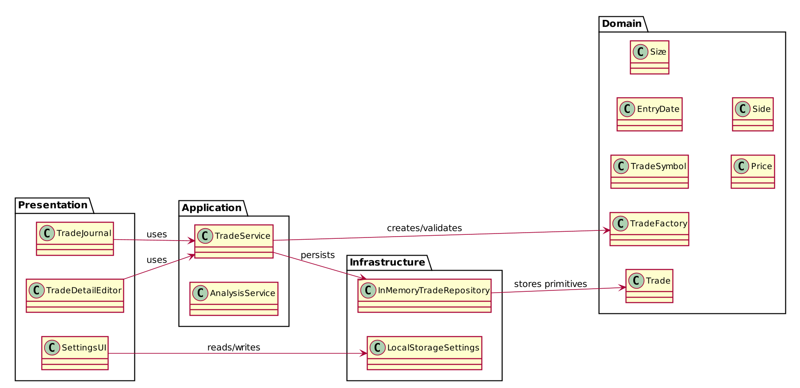
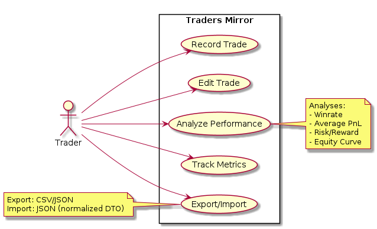

= Architektur (Onion / DDD) for Traders Mirror
:toc:
:toc-placement!:
:icons: font

== Kurze Einführung
Dieses Dokument beschreibt die Architektur der Anwendung "Traders Mirror". Die App ist ein kleines Trading-Journal, mit dem Nutzer Trades erfassen, bearbeiten und einsehen können. Ziel der Architektur ist: klare Trennung von Verantwortlichkeiten, Testbarkeit und leichtes Ersetzen von Adaptern (z.B. InMemory -> DB).

== Übersicht
Die Anwendung folgt dem Onion-Architecture- und Domain-Driven-Design-Ansatz. Die Schichten sind:

* Domain – zentrale Geschäftslogik, Entities, Value Objects, Domain-Fehler
* Application – Use-Cases (Services) fassen Domänenoperationen zusammen
* Infrastructure – Adapter, Repositories, externe Implementierungen
* Presentation – React UI, Form-Validation, Error-Mapping

ifdef::plantuml[]
include::diagrams/architecture.puml[]
else[]
image::diagrams/architecture.png[Architecture diagram,alt="Architecture diagram"]
endif::[]

== Components
Die wichtigsten Komponenten sind in der Komponenten-Übersicht dargestellt. Kurzbeschreibung:

* Presentation
** `TradeJournal` – Haupt-UI, listet Trades, öffnet Editor, führt Filter/Sort aus
** `TradeDetail` / `TradeDetailEditor` – Einzelnen Trade anzeigen und bearbeiten
** `Settings` – Nutzer-Einstellungen (z. B. Debug UI, Import/Export)

* Application
** `TradeService` – Use-Cases zum Erstellen, Aktualisieren, Löschen und Abfragen von Trades
** `AnalysisService` – Aggregationen/Analysen (Winrate, PnL, Equity Curve)

* Domain
** `Trade` – Entity mit Feldern (symbol, entryDate, size, price, side, market, leverage)
** `ValueObjects` – `TradeSymbol`, `EntryDate`, `Size`, `Price`, `Side` (validierung/normierung)
** `TradeFactory` – baut Entitäten aus DTOs/VOs und liefert primitive DTOs zurück

* Infrastructure
** `InMemoryTradeRepository` – Beispiel-Adapter, speichert Trades als primitive Objekte
** `LocalStorageSettings` – Adapter zum Lesen/Schreiben von Settings in localStorage

ifdef::plantuml[]
include::diagrams/components.puml[]
else[]

endif::[]

== Use Cases
Die Hauptfunktionen der Anwendung (Use Cases) sind:

* Record Trade
** Nutzer füllt Formular (Symbol, Datum, Grösse, Preis, Side, Market, Leverage)
** Presentation validiert Eingaben (basic UI validation)
** Application (`TradeService`) ruft `TradeFactory.create` auf, validiert Domain-Regeln
** Repository persistiert das Ergebnis

* Edit Trade
** Nutzer öffnet TradeDetail und passt Felder an
** Gleiches Flussmuster wie Record Trade, mit Update-Operation

* Analyze Performance
** `AnalysisService` aggregiert Trades und berechnet Kennzahlen wie Winrate, Average PnL, Risk/Reward, Equity Curve
** Ergebnisse werden in der UI visualisiert (Charts / Tabellen)

* Track Metrics
** Laufende Metriken (z. B. tägliche PnL, max drawdown)
** Filter/Group-By (Symbol, Market, Timeframe)

* Export/Import
** Export als CSV/JSON für externe Analyse
** Import von JSON-DTOs zur Migration oder Bulk-Import

ifdef::plantuml[]
include::diagrams/usecases.puml[]
else[]

endif::[]

== How to render diagrams
Dieses Repo verwendet PlantUML-Dateien unter `docs/diagrams/*.puml`.
Mit Asciidoctor und dem plantuml-Plugin lassen sich die Diagramme direkt einbetten (z. B. `include::diagrams/architecture.puml[]`).

Beispiel (lokal):

`asciidoctor -r asciidoctor-diagram docs/architecture.adoc`

== Nützliche Pfade im Repo
* `src/domain/` – Domänenmodelle und VOs
* `src/application/` – Use-Case Services
* `src/infrastructure/` – Adapter und Repositories
* `src/presentation/` – React Komponenten und Validation/ErrorMapper

== Weiterführende Hinweise
- Tests: Für jede Domänenklasse/Service existieren Vitest-Tests (`src/**/*.test.ts`)
- Import-Alias: Alle Imports aus `src` verwenden den Alias `@` (Vite/Craco config)

== Use Cases: Warum Analyse & Tracking sinnvoll sind
Das Erfassen und Analysieren von Trades liefert messbare Erkenntnisse, mit denen Trader ihr Verhalten, Risikomanagement und Performance verbessern können. Wichtige Ziele:

* Transparenz: nachvollziehbare Historie aller offenen und geschlossenen Trades
* Lernkurve: Muster in Gewinnern/Verlusten erkennen (z. B. über Winrate, durchschnittlichen PnL, Drawdown)
* Risikokontrolle: Margin-/Leverage-Auswertung und Stop-Loss-Effizienz
* Prozessverbesserung: Identifikation von Systemen/Setups mit wiederkehrender Profitabilität

ifdef::plantuml[]
include::diagrams/usecases.puml[]
else[]

endif::[]
